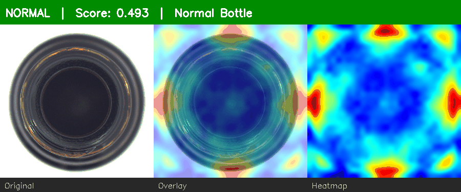

# DefectVision

> Real-time manufacturing defect detection using unsupervised anomaly detection.



*Normal bottle → low score. Defective bottle → red heatmap + ANOMALY alert.*

---

## Overview

DefectVision detects defective products from webcam or RTSP video streams — **trained on normal images only**. No labeled defect data required.

Built on [PatchCore](https://arxiv.org/abs/2106.08265) (CVPR 2022) via [Anomalib](https://github.com/open-edge-platform/anomalib). Evaluated on both [MVTec AD](https://www.mvtec.com/company/research/datasets/mvtec-ad) and the harder [MVTec AD 2](https://www.mvtec.com/company/research/datasets/mvtec-ad-2) (2025).

> **Why unsupervised?** In real factories, defects are rare and varied. A supervised model needs labeled defect images for every defect type. PatchCore only needs normal samples — far more practical for production lines where defects are scarce and unpredictable.

---

## Results

### MVTec AD (benchmark)

| Category | Image AUROC | Pixel AUROC | Target |
|----------|------------|-------------|--------|
| bottle   | **1.0000** | 0.9815      | > 0.98 / > 0.97 ✓ |
| screw    | **0.9820** | 0.9894      | ✓ |
| capsule  | **0.9781** | 0.9877      | ✓ |

### MVTec AD 2 — harder benchmark (2025)

| Category | Image AUROC | Pixel AUROC | Notes |
|----------|------------|-------------|-------|
| vial     | 0.8585     | 0.9201      | Transparent objects, multi-lighting |
| fruit_jelly | 0.8000  | 0.9552      | Overlapping, high intra-class variance |

14–20% Image AUROC drop vs AD 1 — consistent with published SOTA. See [Engineering Decisions](docs/engineering_decisions.md#5-mvtec-ad-vs-mvtec-ad-2-performance-gap).

### Model Comparison (bottle)

| Model | Image AUROC | Train Time |
|-------|------------|------------|
| **PatchCore** | **1.0000** | 211s |
| PaDiM | 0.9913 | 47s |
| EfficientAD | excluded | 1+ hr (impractical) |

---

## Architecture

```
Webcam / RTSP
      │
      ▼
  Camera (OpenCV threaded capture)
      │  frame (BGR)
      ▼
  FrameProcessor  ──── POST /predict ────►  FastAPI Inference API
      │                                          │
      │  overlay (base64 PNG)                    │  PatchCorePredictor
      ▼                                          │  (PyTorch or OpenVINO)
  Streamlit Dashboard                            │
  • Live feed + heatmap overlay             anomaly score
  • Score time-series chart                 heatmap (JET colormap)
  • NORMAL / ANOMALY status                 overlay image
```

---

## Quickstart

### Local

```bash
# 1. Install uv and create venv
pip install uv
uv venv --python 3.11
source .venv/bin/activate
uv pip install -e ".[dev]"

# 2. Train a model (downloads MVTec AD automatically)
python src/train/train.py --category bottle

# 3. Start inference API
python -m uvicorn src.inference.main:app --port 8000

# 4. Start dashboard (new terminal)
streamlit run src/dashboard/app.py

# 5. (Optional) Webcam stream
python src/stream/run.py --source 0
```

### Docker

Docker runs the **API only**. The dashboard requires webcam access and must run locally.

```bash
# API via Docker
docker compose up api --build
# API: http://localhost:8000

# Dashboard locally (webcam access)
streamlit run src/dashboard/app.py
```

### API

```bash
curl http://localhost:8000/health

curl -X POST http://localhost:8000/predict \
  -F "file=@your_image.jpg" | python -m json.tool
```

Response:
```json
{
  "anomaly_score": 0.79,
  "is_anomaly": true,
  "threshold": 0.5,
  "heatmap_b64": "<base64 PNG>",
  "overlay_b64": "<base64 PNG>",
  "model_category": "bottle",
  "runtime": "pytorch"
}
```

---

## Configuration

| Variable | Default | Description |
|----------|---------|-------------|
| `MODEL_PATH` | `results/Patchcore/MVTec/bottle/v3/weights/lightning/model.ckpt` | Checkpoint or OpenVINO `.xml` |
| `MODEL_CATEGORY` | `bottle` | MVTec category |
| `RUNTIME` | `pytorch` | `pytorch` or `openvino` |
| `IMAGE_SIZE` | `256` | Input resolution |
| `THRESHOLD` | *(from checkpoint)* | Override anomaly score threshold |

---

## Project Structure

```
defectvision/
├── src/
│   ├── train/
│   │   ├── train.py            # PatchCore training (MVTec AD)
│   │   ├── train_mvtec2.py     # PatchCore training (MVTec AD 2)
│   │   ├── compare_models.py   # PatchCore vs PaDiM vs EfficientAD
│   │   └── export.py           # OpenVINO IR export + latency benchmark
│   ├── inference/
│   │   ├── main.py             # FastAPI app (lifespan pattern)
│   │   ├── model.py            # PatchCorePredictor (PyTorch + OpenVINO)
│   │   └── schemas.py          # Pydantic request/response models
│   ├── stream/
│   │   ├── camera.py           # Threaded webcam/RTSP capture
│   │   ├── processor.py        # Frame → API → overlay pipeline
│   │   └── run.py              # Standalone webcam runner
│   └── dashboard/
│       └── app.py              # Streamlit real-time dashboard
├── tests/
│   ├── test_inference.py
│   └── test_stream.py
├── docs/
│   ├── engineering_decisions.md
│   └── development.md
├── Dockerfile
├── docker-compose.yml
└── .github/workflows/ci.yml
```

---

## Tech Stack

| Component | Technology | Reason |
|-----------|-----------|--------|
| Anomaly Detection | Anomalib 1.2 + PatchCore | Industry-standard, SOTA on MVTec AD |
| ML Framework | PyTorch 2.x | MPS acceleration on Apple Silicon |
| Edge Export | OpenVINO | 2–5× speedup on Intel hardware |
| Inference API | FastAPI | Async, consistent with other portfolio projects |
| Dashboard | Streamlit | Rapid real-time visualisation |
| Video Capture | OpenCV | Webcam + RTSP, threaded capture |
| Python | 3.11 | Anomalib 1.2 compatibility |

---

## Further Reading

- [Engineering Decisions](docs/engineering_decisions.md) — Why PatchCore? Model comparison. AD 1 vs AD 2 gap. OpenVINO benchmark.
- [Development Log](docs/development.md) — Phase-by-phase implementation notes and troubleshooting.
- [PatchCore paper](https://arxiv.org/abs/2106.08265) — "Towards Total Recall in Industrial Anomaly Detection" (CVPR 2022)
- [MVTec AD 2 paper](https://arxiv.org/abs/2503.21622) — 2025 benchmark update
